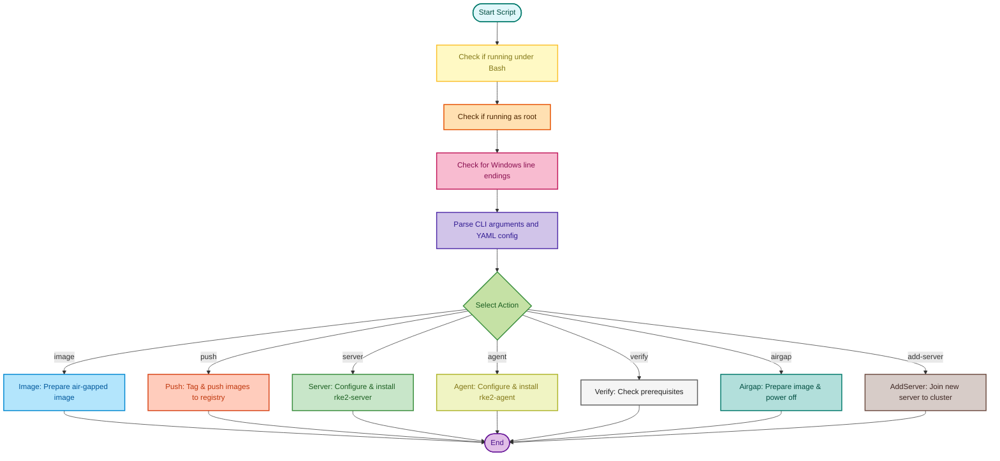

# rke2nodeinit.sh

[](https://github.com/cantrellr/rke2-node-init/actions/workflows/validate-rke-configs.yml)
[](https://github.com/cantrellr/rke2-node-init/actions/workflows/validate-vm-configs.yml)
[](https://github.com/cantrellr/rke2-node-init/actions/workflows/certs-ci.yml)
[](https://github.com/cantrellr/rke2-node-init/actions/workflows/verify-tokenfile.yml)
[](LICENSE)
[](#workflow-overview)
[](#workflow-overview)
[](#command-reference)
[](#key-capabilities)

```text
 ____  _  _______     _   _  ___  ____  _____              
|  _ \| |/ / ____|   | \ | |/ _ \|  _ \| ____|
| |_) | ' /|  _|     |  \| | | | | | | |  _|
|  _ <| . \| |___    | |\  | |_| | |_| | |
|_| \_\_|\_\_____|   |_| \_|\___/|____/|_____|

 ___ _   _ ___ _____
|_ _| \ | |_ _|_   _|
 | ||  \| || |  | |
 | || |\  || |  | |
|___|_| \_|___| |_|

offline bootstrap and lifecycle automation for air-gapped RKE2
```

`bin/rke2nodeinit.sh` is a production-focused automation framework for building, validating, and operating fully offline Rancher RKE2 clusters on Ubuntu/Debian hosts. It combines air-gap artifact staging, registry mirroring, node bootstrap, OS-level hardening, and repeatable server/agent provisioning into one consistent workflow driven by CLI flags or `rkeprep/v2` YAML manifests.

This repository is designed for platform and infrastructure teams that need Kubernetes delivery in disconnected, regulated, or high-assurance environments where reliability, traceability, and deterministic behavior matter more than convenience.

At a glance, this project provides:

- **Deterministic Air-Gap Operations**: Pull once in a connected environment, then install repeatedly offline with staged and validated artifacts.
- **End-to-End Node Lifecycle Automation**: Move from image preparation to control-plane and worker provisioning using a single operational contract.
- **Security-First Defaults**: Strong shell safety settings, strict input validation, secret masking, and hardened network/system behaviors.
- **Operational Clarity**: Structured logs, explicit phase behavior, reproducible manifest-driven runs, and preflight verification support.

Design principles for this repo:

- **Offline-first execution model** for post-image workflows.
- **Portable tooling** based on Bash and standard GNU/Linux utilities.
- **Fail-fast validation** for missing images, bad tags, and invalid configuration.
- **PR-friendly change control** with documentation, tests, and CI references aligned to production operations.

Only the `image` action requires Internet access to gather artifacts. All other actions (`push`, `server`, `add-server`, `agent`, `verify`, and `airgap`) are intended to run without public Internet access when the environment is staged correctly.

---

## Table of Contents

- [rke2nodeinit.sh](#rke2nodeinitsh)
  - [Table of Contents](#table-of-contents)
  - [Key Capabilities](#key-capabilities)
  - [Supported Platforms \& Requirements](#supported-platforms--requirements)
  - [Workflow Overview](#workflow-overview)
  - [Process Flow Chart](#process-flow-chart)
  - [Actions Breakdown](#actions-breakdown)
  - [STIG Hardening Helper](#stig-hardening-helper)
  - [Command Reference](#command-reference)
    - [Common Flags](#common-flags)
    - [Makefile Helpers](#makefile-helpers)
  - [YAML Configuration Reference](#yaml-configuration-reference)
  - [Boot Service ISO Workflow](#boot-service-iso-workflow)
  - [Offline Registry \& CA Handling](#offline-registry--ca-handling)
  - [Certificate Management](#certificate-management)
    - [Security Requirements](#security-requirements)
    - [Directory Layout](#directory-layout)
    - [Supported Generation Workflows](#supported-generation-workflows)
    - [Integrating with `rkeprep/v2` Manifests](#integrating-with-rkeprepv2-manifests)
    - [Operational Verification](#operational-verification)
    - [CI Coverage](#ci-coverage)
    - [Related Documentation](#related-documentation)
  - [Network Configuration Strategy](#network-configuration-strategy)
  - [Logging \& Observability](#logging--observability)
  - [Safety Controls \& Idempotency](#safety-controls--idempotency)
  - [Generated Files \& Directory Layout](#generated-files--directory-layout)
  - [Verification \& Troubleshooting](#verification--troubleshooting)
  - [Maintenance \& Rollback Tips](#maintenance--rollback-tips)
  - [Appendix: Environment Variables](#appendix-environment-variables)

---

## Key Capabilities

- **Air-Gapped Friendly** – Downloads every RKE2 artifact (images, binaries, checksums, installer) in advance and stages them under `/opt/rke2/stage` for disconnected installs.
- **Hardened CNI Alignment** – Supports explicit or auto-detected tags for `hardened-cni-plugins`, `hardened-multus-cni`, and `hardened-flannel` (via `spec.rke2CNIVersion`, `spec.rke2MultusVersion`, and `spec.rke2FlannelVersion`) and stages required archives for offline pulls.
- **CNI Image Preflight** – During `image`, validates that staged archives contain required images for configured `spec.cni` plugins (for example Multus/Canal) and fails fast when required images are missing.
- **Required Image/Tag Enforcement** – Builds a required image:tag set from chart/release metadata and strictly verifies that staged on-node archives contain every required reference before allowing `image`, `server`, or `agent` workflows to continue.
- **Container Runtime Alignment** – Installs the official `nerdctl` bundles (standalone + FULL) and enables containerd with systemd cgroup support while avoiding extra runtime dependencies.
- **Registry Mirroring & Trust** – Writes `/etc/rancher/rke2/registries.yaml` with mirror priorities, optional authentication, and custom certificate authorities. Automatically pushes cached images with SBOM metadata.
- **First-Boot ISO Automation** – Optional boot service mode builds one ISO per node YAML (`metadata.name.iso`) and executes `rke2nodeinit.sh -f` from YAML discovered under `/config` on attached virtual CD media.
- **Network Hardening** – Disables cloud-init network rendering, purges legacy Netplan files, writes a single authoritative static IPv4 configuration, and applies it immediately.
- **Security Guardrails** – Runs with `set -Eeuo pipefail`, surfaces line numbers on failure, validates user input, masks secrets when printing YAML, and clamps file permissions.
- **Operational Transparency** – Streams all steps to `logs/` with timestamps and hostnames. Long-running tasks show CLI spinners while stdout remains concise.
- **Reusable Defaults** – Persistently stores DNS/search defaults and custom CA information so subsequent server/agent runs reuse the captured site context.

---

## Supported Platforms & Requirements

| Category | Details |
| --- | --- |
| Operating systems | Ubuntu/Debian variants with `systemd`, `apt`, and `netplan` |
| Privileges | Must be executed as `root` (use `sudo`) |
| Connectivity | `image` requires Internet access for artifact acquisition. `push`, `server`, `agent`, `verify`, and `airgap` must run without Internet access |
| Disk space | Several GB for RKE2 tarballs, images, SBOM data, and logs |
| Optional tooling | [`syft`](https://github.com/anchore/syft) for SPDX SBOMs. Without it, nerdctl inspect metadata is produced |
| External dependencies | Private registry endpoint, optional custom CA, and YAML configuration matching `apiVersion: rkeprep/v2` |

---

## Workflow Overview

1. **Image (online artifact gathering & base preparation):** Detect or pin an RKE2 release, download all artifacts, verify checksums, cache nerdctl bundles, install OS prerequisites, copy cached artifacts into `/opt/rke2/stage`, validate CNI-required staged images from `spec.cni`, strictly validate required image:tag references against staged archives, capture default DNS/search domains, install optional CA trust, and reboot so the VM can be templated. This step downloads supplemental content and therefore requires Internet access.
2. **Push (offline registry sync):** Load cached images into containerd, retag them against a private registry prefix, generate SBOM or inspect data, and push to an internally reachable registry without using the public Internet.
3. **Server / Add-Server (offline host):** Configure hostname, static networking, TLS SANs, registries, custom CA trust, and execute the cached RKE2 installer. Before install, staged artifacts are revalidated, including strict required image:tag presence checks.
4. **Agent (offline host):** Mirror the server flow while collecting join tokens, optional CA trust, and persisting run artifacts to `outputs/<metadata.name>/`. The same strict staged image:tag validation runs before install.
5. **Verify:** Perform prerequisite checks without mutating the system. Useful for smoke tests and compliance validation.

When `image`/`airgap` is run with boot service enabled, the script also generates per-node boot ISOs from a YAML directory (`bootService.yamlPath` or `--boot-yaml-path`). At first boot, the service mounts attached ISO media, selects the first YAML under `/config`, copies it into `/root/server-config`, and executes `rke2nodeinit.sh -f <copied-yaml> -y`.

Each action can be driven directly from the CLI or from a YAML manifest (`apiVersion: rkeprep/v2`) that centralizes inputs and secrets.

For strict offline clusters, provide complete image bundles for the selected CNI stack (for example `rke2-images-*.linux-amd64.tar.*` flavor archives in addition to the base `rke2-images.linux-amd64.tar.zst`). Staging only `hardened-cni-plugins` is not sufficient for Multus/Canal.

---

## Process Flow Chart



---

## Actions Breakdown

| Action | Typical Location | Description |
| --- | --- | --- |
| `push` | Offline registry host | Push cached images into your private registry, emitting manifests + SBOMs without touching the public Internet |
| `image` | Connected template host (Internet required) | Download & verify RKE2 release artifacts and nerdctl bundles, install prereqs, stage artifacts, configure registry trust, capture defaults, and reboot |
| `server` | Offline RKE2 control-plane | Configure static networking, TLS, tokens, custom CA, and install `rke2-server` |
| `add-server` | Offline additional control-plane | Same as `server` but tailored for existing clusters |
| `agent` | Offline worker node | Configure network, join tokens, CA trust, and install `rke2-agent` |
| `verify` | Any host | Validate prerequisites without making changes |
| `airgap` | Offline template | Runs `image` but powers off instead of rebooting, ideal for VM templating |
| `label-node` | Running cluster node | Apply Kubernetes labels with `kubectl` using YAML or CLI-provided labels |
| `taint-node` | Running cluster node | Apply Kubernetes taints with `kubectl` using YAML or CLI-provided taints |
| `list-images` | Any host with staged artifacts | Display effective/staged RKE2 image archives and required image references |

Each action honors both CLI flags and YAML values. When both are provided, YAML values take precedence and are logged accordingly.

---

## STIG Hardening Helper

The repository includes a STIG helper script and guidance for firewall zoning and RKE2 host-side checks. See [docs/STIG-README.md](docs/STIG-README.md) for the workflow, report output, and example commands, including the `-image` golden template mode.

---

## Command Reference

```bash
# With a manifest
sudo ./bin/rke2nodeinit.sh -f configs/preprod/preprod-vmware-v1.35.3+rke2r3-image.yaml image

# Direct action without YAML
sudo ./bin/rke2nodeinit.sh --dry-push push -r reg.example.local/rke2 -u svc -p 'secret'

# Print sanitized manifest for auditing
sudo ./bin/rke2nodeinit.sh -f configs/preprod/nodes/dc1manager-ctrl01.yaml -P server
```

### Common Flags

| Flag | Purpose |
| --- | --- |
| `-f FILE` | Path to YAML manifest (must include `metadata.name`) |
| `-v VERSION` | Explicit RKE2 release (e.g., `v1.34.1+rke2r1`) |
| `-r REGISTRY` | Private registry (host[/namespace]) |
| `-u/-p` | Registry credentials |
| `-y` | Auto-confirm prompts (reboots, legacy runtime cleanup) |
| `-P` | Print sanitized YAML (passwords/tokens masked) |
| `--dry-push` | Simulate `push` without contacting the registry |
| `--enable-fips` | Enable OS FIPS mode (Ubuntu Pro) and prefer FIPS RKE2 builds |
| `--fix-cni-permissions` | During `image`, install/enable timer-based CNI permission remediation |
| `--enable-boot-service` | Install and enable first-boot automation for VM template workflows (`image`/`airgap` actions) |
| `--boot-yaml-path PATH` | Directory containing per-node YAML files used to build boot ISOs |
| `--boot-mode MODE` | Boot service mode: `oneshot` (run once) or `persistent` (rerun only when ISO YAML hash changes) |
| `-h` | Display built-in help |

### Makefile Helpers

- `make token` generates a base64 token using OpenSSL. Override the byte length with `TOKEN_SIZE=<n>` (default `32`) to control entropy, for example `make token TOKEN_SIZE=24`.
- Each invocation prints the token to stdout and stores it under `outputs/generated-token/token-<YYYYMMDD-HHMMSS>.txt` with restrictive permissions so it can be reused later.
- `make sh` marks every `*.sh` file in the repository root as executable so helper scripts remain runnable after cloning.
- `make kubeconfig` installs `kubectl`, copies the RKE2 kubeconfig to `~/.kube/config`, and runs a quick connectivity check.
- `make boot-isos` builds one ISO per YAML from `BOOT_ISO_YAML_DIR` (default `configs/preprod/nodes`) and writes a manifest to `BOOT_ISO_MANIFEST`.
- `make boot-isos-clean` removes generated boot ISO artifacts under `BOOT_ISO_OUTPUT_DIR`.

## YAML Configuration Reference

All manifests must set `apiVersion: rkeprep/v2` and `metadata.name`. The `kind` selects the action. Only relevant fields for each action are consumed; extra keys are ignored safely.

```yaml
apiVersion: rkeprep/v2
kind: Image
metadata:
  name: prod-image
spec:
  rke2Version: v1.34.1+rke2r1
  rke2CNIVersion: v1.9.0-build20260116
  rke2MultusVersion: v4.2.3-build20260120
  rke2FlannelVersion: v0.28.0-build20260119
  registry: registry.example.local/rke2
  registryUsername: svc
  registryPassword: superSecret123!
  defaultDns: [10.10.10.10, 10.10.20.10]
  defaultSearchDomains: [cluster.local, example.local]
  customCA:
    rootCrt: certs/root.crt
    intermediateCrt: certs/intermediate.crt
    installToOSTrust: true
  bootService:
    enabled: true
    yamlPath: configs/preprod/nodes
    mode: oneshot
    platform: vmware
```

**Supported spec keys (highlights):**

- **Networking:** `ip`, `prefix`, `gateway`, `dns`, `searchDomains`
- **TLS:** `tlsSans`, `token`, `tokenFile`
- **Registry:** `registry`, `registryUsername`, `registryPassword`, `customCA.*`
- **Image prep:** `rke2Version`, `rke2CNIVersion`, `rke2MultusVersion`, `rke2FlannelVersion`
- **CNI remediation:** `fixCNIPermissions` (boolean; when true, `image` enables CNI permission remediation service+timer)
- **RKE2 Config:** `cluster-cidr`, `service-cidr`, `cluster-dns`, `cluster-domain`, `system-default-registry`, `node-taint`, `node-label`, `disable`, etc.
- **Boot service:** `bootService.enabled`, `bootService.yamlPath` (directory), `bootService.mode`, `bootService.platform`

The script normalizes CSV values (commas or YAML lists) and masks secrets when printing sanitized output (`-P`).

---

## Boot Service ISO Workflow

1. Enable boot service in an `Image`/`Airgap` run (`bootService.enabled: true` or `--enable-boot-service`).
2. Provide a YAML directory via `bootService.yamlPath` or `--boot-yaml-path`.
3. The image workflow generates `metadata.name.iso` artifacts and a TSV manifest.
4. During VM provisioning, attach one generated ISO as virtual CD media.
5. On first boot, `rke2-boot.service` mounts ISO9660 media and finds the first `*.yaml`/`*.yml` under `/config`.
6. The selected YAML is copied to `/root/server-config/<yaml-filename>` with `0600` permissions.
7. The service executes `rke2nodeinit.sh -f <copied-yaml> -y`.
8. In `persistent` mode, reruns occur only when the selected YAML hash changes.

Notes:
- Hostname matching is not required by the boot service.
- ISO payload contract is `/config/<yaml>`.
- The source YAML content is copied as-is into the ISO payload.

---

## Offline Registry & CA Handling

- During the `image` action, `spec.customCA` paths can be relative or absolute and are resolved before trust/registry processing.
- When `customCA.installToOSTrust: true`, both `customCA.rootCrt` and `customCA.intermediateCrt` (when present) are copied into `/usr/local/share/ca-certificates` as `*.crt`, then refreshed with `update-ca-certificates --verbose --fresh`.
- When `spec.customCA` is present, `image` generates a bootstrap token file at `outputs/<metadata.name>-bootstrap-token.txt` using the same CA-hash token logic as the `custom-ca` action.
- When boot service node manifests include `spec.tokenFile`, `image` also writes compatibility token aliases for token paths under `/rke2-node-init/outputs` so cloned nodes can consume a stable filename.
- In `server` flow, when `spec.tokenFile` is provided but unreadable at runtime, initialization falls back to a generated first-server token instead of blocking startup.
- `/etc/rancher/rke2/registries.yaml` is rendered with mirrors, optional fallback endpoints, and auth blocks derived from the manifest.
- Image pushes produce both `outputs/images-manifest.json` and `.txt` describing source → target retags, plus SBOM or inspect metadata per image under `outputs/sbom/`.
- Registry hosts can be pinned into `/etc/hosts` when IP addresses are provided, ensuring offline name resolution.

---

## Certificate Management

Certificate manifests used by bootstrap workflows live under `configs/cotpa/certs/`, while certificate generation utilities live under `scripts/certs/`.

### Security Requirements

- Never commit real private keys or production certificates.
- Treat `*.pem` and `*.key` as sensitive material.
- Generate CA assets on trusted hosts and move root keys to offline secure storage.
- Use encrypted private keys whenever operationally feasible.

### Directory Layout

```text
configs/cotpa/certs/
├── *.crt / *.pem                  # Cluster/site CA material

scripts/certs/
├── generate-ca.sh
├── generate-root-ca.sh
├── generate-subordinate-ca.sh
├── verify-chain.sh
└── outputs/                       # Script-generated outputs (local use)
```

Example certificate fixtures live in `examples/certs/`.

### Supported Generation Workflows

1. Legacy single-CA helper:

```bash
./scripts/certs/generate-ca.sh --cn "Example RKE2 CA" --org "Example Org"
```

Creates `rke2ca-cert-key.pem`, `rke2ca-cert.crt`, and `rke2registry-ca.crt` under `scripts/certs/`.

1. Root + subordinate CA chain (recommended):

```bash
# Create encrypted root CA
./scripts/certs/generate-root-ca.sh --out-dir scripts/certs/outputs/root-ca

# Create subordinate CA signed by root
./scripts/certs/generate-subordinate-ca.sh \
  --input examples/certs/rke2clusterCA-example.yaml \
  --out-dir scripts/certs/outputs/sub-ca \
  --root-key scripts/certs/outputs/root-ca/root-ca-key.pem \
  --root-cert scripts/certs/outputs/root-ca/root-ca.crt
```

1. Chain verification:

```bash
./scripts/certs/verify-chain.sh \
  --root scripts/certs/outputs/root-ca/root-ca.crt \
  --sub scripts/certs/outputs/sub-ca/subordinate-ca.crt \
  --sub-key scripts/certs/outputs/sub-ca/subordinate-ca-key.pem
```

### Integrating with `rkeprep/v2` Manifests

Use `kind: CustomCA` manifests to reference CA assets consumed by `bin/rke2nodeinit.sh`:

```yaml
apiVersion: rkeprep/v2
kind: CustomCA
metadata:
  name: cluster-ca
spec:
  customCA:
    rootCrt: /rke2-node-init/configs/preprod/certs/root-ca.crt
    rootKey: /rke2-node-init/configs/preprod/certs/root-ca-key.pem
    intermediateCrt: /rke2-node-init/configs/preprod/certs/subordinate-ca.crt
    intermediateKey: /rke2-node-init/configs/preprod/certs/subordinate-ca-key.pem
    installToOSTrust: true
```

For sample values, see `examples/certs/rke2clusterCA-example.yaml`.

### Operational Verification

Useful checks before deployment:

```bash
openssl x509 -in scripts/certs/outputs/root-ca/root-ca.crt -noout -text
openssl x509 -in scripts/certs/outputs/sub-ca/subordinate-ca.crt -noout -enddate
openssl verify \
  -CAfile scripts/certs/outputs/root-ca/root-ca.crt \
  scripts/certs/outputs/sub-ca/subordinate-ca.crt
```

### CI Coverage

- `tests/ci/test_ca_generation.sh`
- `tests/ci/test_subordinate_encryption.sh`
- `.github/workflows/certs-ci.yml`

### Related Documentation

- `scripts/certs/README.md`
- `docs/CLI-REFERENCE.md`
- `docs/OPERATIONAL-RUNBOOK.md`
- `docs/TROUBLESHOOTING.md`
- `docs/TESTING-GUIDE.md`
- `SECURITY.md`
- `README.md`

---

## Network Configuration Strategy

- Cloud-init network rendering is disabled (`/etc/cloud/cloud.cfg.d/99-disable-network-config.cfg`).
- Existing Netplan YAML files are backed up under `/etc/netplan/.backup-<timestamp>/` before being removed.
- A single authoritative file (`/etc/netplan/99-rke-static.yaml`) is written using the provided IPv4, prefix, gateway, DNS, and search domains.
- Netplan is applied immediately, and interfaces/routes are logged for post-check analysis.

---

## Logging & Observability

- Every execution streams to `logs/rke2nodeinit_<UTC>.log`. When a manifest sets `metadata.name`, action-specific logs are created (e.g., `logs/prod-image_<timestamp>.log`).
- `spinner_run()` ensures long-running downloads/installations emit real-time progress while keeping logs verbose.
- Sensitive values (passwords, tokens) are masked before being printed. Registry credentials are written with `chmod 600`.

---

## Safety Controls & Idempotency

- Script exits on error (`set -Eeuo pipefail`) and reports the failing line number.
- Input validation covers IPv4 addresses, prefixes, DNS lists, and search domains.
- Swap is disabled both immediately and persistently. Kernel modules and sysctl values required by Kubernetes are enforced.
- `verify` mode reuses the same validation logic without mutating the host, making it ideal for change control workflows.

---

## Generated Files & Directory Layout

```text
<repo>/
├─ downloads/                        # image/push cache (images, tarballs, installers, nerdctl bundles)
├─ outputs/
│  ├─ <metadata.name>/               # run-specific exports (README, configs, CA copies)
│  └─ sbom/                          # SBOM outputs per image (text inventory + SPDX 2.3 JSON)
├─ logs/                             # structured execution logs
├─ configs/                          # environment-scoped manifests and runtime cert material
├─ bin/rke2nodeinit.sh               # primary entrypoint script
└─ README.md
```

System locations used during installation:

- `/opt/rke2/stage/` – cached artifacts for offline installer
- `/var/lib/rancher/rke2/agent/images/` – pre-loaded image archive including the chart-matched `hardened-cni-plugins` tar when staged
- `/etc/rancher/rke2/` – generated configs, registries YAML, saved join info
- `/usr/local/share/ca-certificates/` – custom registry certificates
- `/etc/netplan/99-rke-static.yaml` – authoritative static network config
- `/etc/rke2image.defaults` – captured defaults reused by later actions

---

## Verification & Troubleshooting

- Run `sudo ./bin/rke2nodeinit.sh verify` to confirm prerequisites (kernel modules, swap state, iptables backend, NetworkManager, UFW rules, staged artifacts).
- `image`, `server`, and `agent` now fail fast when required chart/release image tags are not present in staged archives under `/var/lib/rancher/rke2/agent/images` and `/opt/rke2/stage`.
- Log files provide timestamps and PIDs for forensic review. Search for `[ERROR]` or `[WARN]` entries to triage issues.
- `outputs/<name>/README.txt` summarizes what `image` staged, including versions, registry endpoints, and next steps.
- When custom CA installation fails, review `/usr/local/share/ca-certificates/` and rerun `update-ca-certificates --verbose --fresh` manually.
- If Multus fails with `cannot find valid master CNI config` while Canal is present, apply the persistent CNI permissions remediation documented in [docs/STIG-README.md](docs/STIG-README.md#persistent-cni-permissions-remediation-canal--multus).

---

## Maintenance & Rollback Tips

- **Uninstall RKE2:** disable the services and remove `/etc/rancher`, `/var/lib/rancher`, `/var/lib/rke2`, `/var/lib/kubelet`, and RKE2 binaries.
- **Remove containerd/nerdctl:** stop the service, delete `/usr/local/bin/{containerd*,ctr,nerdctl,runc,buildkit*}`, `/opt/cni`, and `/etc/containerd`.
- **Restore networking:** delete `/etc/netplan/99-rke-static.yaml`, restore backup YAMLs, and `netplan apply`.
- **Re-enable IPv6:** remove `/etc/sysctl.d/99-disable-ipv6.conf` and run `sysctl --system`.

---

## Appendix: Environment Variables

The script honors several environment variables that can be set prior to execution:

| Variable | Purpose |
| --- | --- |
| `RKE2_VERSION` | Pin the release without using `-v` |
| `CONFIG_FILE` | Alternate method to point at a manifest |
| `AUTO_YES` | Set to `1` to auto-confirm prompts (same as `-y`) |
| `DRY_PUSH` | Set to `1` to simulate registry pushes |
| `NO_REBOOT` | Used internally by `action_airgap` to skip rebooting |
| `PRO_TOKEN` | Ubuntu Pro token required for `--enable-fips` on Ubuntu |

---

For more examples, inspect the `examples/` directory or review the inline help via `./bin/rke2nodeinit.sh -h`.
