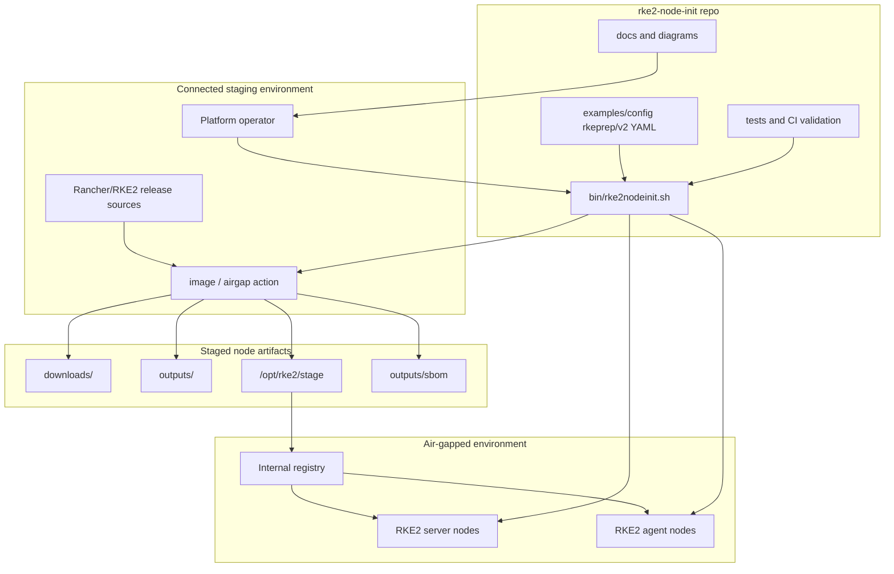
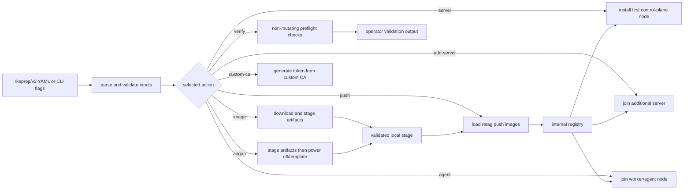
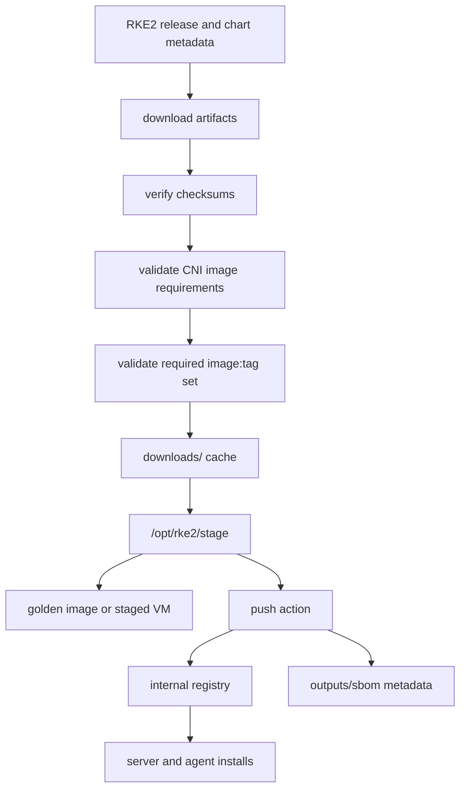
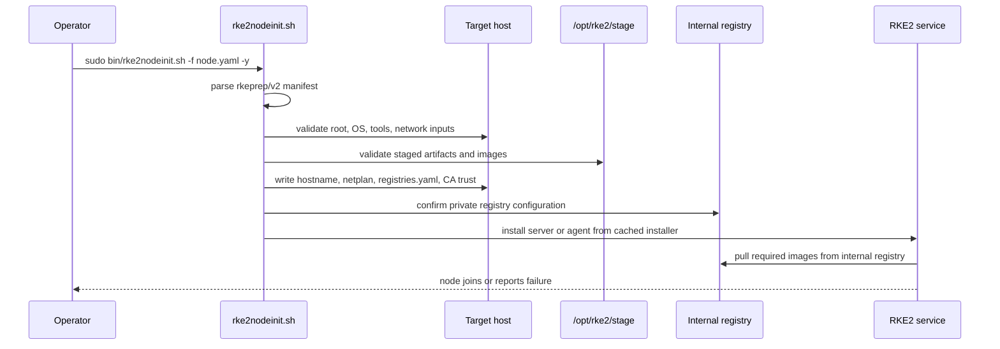
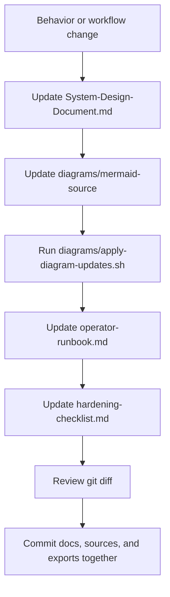

# RKE2 Node Init System Design Document

**Repository:** `cantrellr/rke2-node-init`  
**Primary entrypoint:** `bin/rke2nodeinit.sh`  
**Configuration API:** `rkeprep/v2` YAML  
**Design posture:** offline-first, artifact-driven, operator-controlled RKE2 node lifecycle automation

Diagram export: [SVG](../diagrams/svg/system-design-document-diagram-01.svg) | [PNG](../diagrams/png/system-design-document-diagram-01.png)

---

## 1. Purpose

`rke2-node-init` provides repeatable automation for preparing and operating RKE2 nodes where public Internet access is limited or unavailable. It centralizes artifact staging, image validation, registry trust, network configuration, custom CA handling, server bootstrap, agent bootstrap, and verification into a single operator workflow.

The repo is intentionally not a full cluster-management product. It is the node preparation and bootstrap layer that feeds a larger air-gapped Kubernetes platform.

---

## 2. System Responsibilities

| Area | Responsibility |
| --- | --- |
| Artifact staging | Download RKE2 binaries, image archives, checksums, installer content, CNI artifacts, nerdctl bundles, and supporting files during connected workflows. |
| Offline install preparation | Copy validated artifacts to `/opt/rke2/stage` so disconnected workflows can execute without public Internet. |
| Registry population | Load, retag, generate metadata/SBOM output, and push staged images to an internal registry. |
| Node bootstrap | Configure hostnames, static interfaces, registries, custom CA trust, RKE2 config, and systemd services. |
| Validation | Fail fast on missing artifacts, bad config, missing required image references, invalid networking, or missing token/CA material. |
| Documentation | Maintain current-state system design, runbook, hardening checklist, and diagram exports. |

---

## 3. Execution Model

Diagram export: [SVG](../diagrams/svg/system-design-document-diagram-02.svg) | [PNG](../diagrams/png/system-design-document-diagram-02.png)

Connectivity boundary:

- `image` and `airgap` are connected-side artifact workflows.
- `push`, `server`, `add-server`, `agent`, `verify`, `label-node`, `taint-node`, and `custom-ca` are designed for staged or air-gapped execution.

---

## 4. Repository Architecture

| Path | Purpose |
| --- | --- |
| `bin/rke2nodeinit.sh` | Main automation script and action dispatcher. |
| `examples/config/` | YAML examples for `rkeprep/v2` manifests. |
| `scripts/` | Supporting utility scripts. |
| `tests/` | Shell, YAML, certificate, and workflow validation helpers. |
| `docs/` | Current documentation plus legacy/reference material. |
| `diagrams/` | Mermaid source and generated diagram exports. |
| `downloads/` | Local artifact cache; ignored by Git. |
| `outputs/` | Runtime output, logs, copied configs, metadata, and SBOM data; ignored by Git. |
| `logs/` | Execution logs; ignored by Git. |
| `apps/ipam/` | Optional IPAM companion app. |

---

## 5. Artifact Lifecycle

Diagram export: [SVG](../diagrams/svg/system-design-document-diagram-03.svg) | [PNG](../diagrams/png/system-design-document-diagram-03.png)

The most important control is that staged images must match the selected RKE2 release, selected CNI stack, and generated required image list before the system proceeds to offline bootstrap.

---

## 6. Node Bootstrap Model

Diagram export: [SVG](../diagrams/svg/system-design-document-diagram-04.svg) | [PNG](../diagrams/png/system-design-document-diagram-04.png)

---

## 7. Trust Boundaries

| Boundary | Control |
| --- | --- |
| Internet to staging host | Restrict Internet use to artifact acquisition workflows. |
| Staging host to air gap | Transfer only validated artifacts, configs, and generated metadata. |
| Private registry | Use explicit registry endpoint, optional credentials, and custom CA trust. |
| Node config | Use reviewed `rkeprep/v2` manifests and avoid ad hoc manual edits. |
| Secrets | Mask YAML output and avoid committing token files, passwords, generated cert keys, logs, or outputs. |
| Documentation | Keep Mermaid source and rendered exports synchronized with behavior. |

---

## 8. Boot Service ISO Workflow

The optional boot-service workflow packages per-node YAML into ISO media for first-boot automation. The VM receives an ISO containing `/config/<node>.yaml`; the boot service copies that YAML to a local target directory and runs `rke2nodeinit.sh -f <yaml> -y`.

This is useful for Hyper-V or VM factory workflows where per-node config needs to follow a cloned VM into an offline network.

---

## 9. Security and Hardening Design

Security controls are layered:

- root execution enforcement;
- Bash and CRLF validation;
- `set -Eeuo pipefail` and line-number error reporting;
- strict input validation for addresses, prefixes, DNS, gateways, and domains;
- secret masking for sanitized YAML output;
- required image/tag validation before install;
- registry CA and mirror configuration;
- optional custom CA handling;
- STIG helper and CNI permission remediation support;
- ignored runtime paths for logs, outputs, downloads, and generated material.

---

## 10. Documentation Governance

Diagram export: [SVG](../diagrams/svg/system-design-document-diagram-05.svg) | [PNG](../diagrams/png/system-design-document-diagram-05.png)

The canonical current docs are this file, `operator-runbook.md`, `hardening-checklist.md`, and `documentation-maintenance.md`. Older uppercase docs and redesign/report folders are retained as historical references, not as the first-read source of truth.

---

## 11. Known Failure Modes

| Failure | Likely cause | First response |
| --- | --- | --- |
| Missing image reference during bootstrap | Staged image archive does not match selected RKE2/CNI set | Re-run connected `image` workflow and validate required images. |
| Registry push fails | Bad registry endpoint, credentials, CA trust, or tag prefix | Validate `registries.yaml`, login, CA trust, and dry-run push. |
| Node fails to join | Token, CA, SAN, DNS, or endpoint mismatch | Check token file, CA bundle, server URL, and node DNS. |
| Netplan issue | Invalid interface, gateway, prefix, or multiple default route conflict | Run `verify`, inspect YAML, and apply one authoritative network model. |
| Boot ISO does not run | ISO not attached, YAML missing under `/config`, or boot service disabled | Inspect systemd service logs and ISO contents. |
| Mermaid export drift | Docs updated without source/export regeneration | Run `./diagrams/apply-diagram-updates.sh .`. |

---

## 12. Roadmap

Near-term documentation and automation improvements:

- fold remaining active details from legacy docs into the canonical runbook;
- add stricter documentation drift checks to CI;
- expand SBOM/provenance validation examples;
- add more focused runbook snippets for multi-cluster and multi-interface deployments;
- render and commit SVG/PNG diagrams locally when GitHub Actions are not used.
