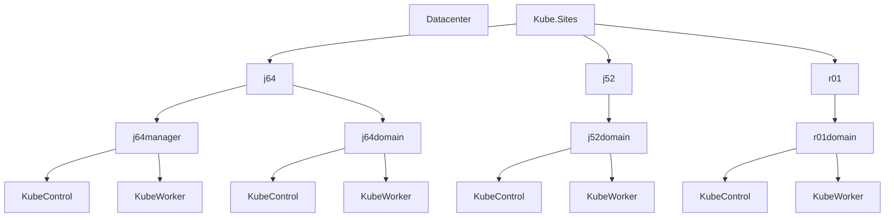

# RKE2-vSphere-Resource-Pools.md

──────────────────────────────
Documentation & Notes
──────────────────────────────
• Pre-requisites:
  – You must manually create the top-level folder and resource pool named "Kube.Sites" in vCenter.
  – VMs must follow a naming convention that includes “ctrl” for controllers and “work” for workers.
  – PowerCLI is installed and loaded.
  – The CSV requirements remain:
      • j64manager: 22 vCPUs / 88 GB → with 30% overhead becomes ~28.6 vCPUs (28600 MHz) and ~114 GB memory.
      • j64domain, j52domain, r01domain: 18 vCPUs / 72 GB → with 30% overhead becomes ~23.4 vCPUs (23400 MHz) and ~94 GB memory.

• Script Structure:
  1. Prompts for vCenter details and logs into vCenter.
  2. Verifies the existence of the top-level folder (“Kube.Sites”) and resource pool (“Kube.Sites”) in the specified datacenter and cluster.
  3. Under “Kube.Sites,” it creates site folders (j64, j52, r01) and the subordinate subfolders:
       - Under j64, creates “j64manager” and “j64domain”.
       - Under j52 creates “j52domain”.
       - Under r01 creates “r01domain”.
     Additionally, optional subfolders “KubeControl” and “KubeWorker” are created within each cluster folder.
  4. The script then verifies the top-level resource pool “Kube.Sites” exists in the cluster and creates corresponding site resource pools (j64, j52, r01) under it.
  5. Under the site resource pools, the script creates subordinate resource pools (j64manager, j64domain, j52domain, r01domain) using the calculated CPU and memory reservations.
  6. A helper function is used to search the appropriate folder for VMs (by name pattern) and then generate DRS anti-affinity rules to separate controllers and workers.

───────────────────────────────  
1. ESXi Host Capacities and Available Resources

Using a 30% reservation (or “buffer”) for the host’s overall CPU and memory resources means that the resource allocations provided to the VMs (via the resource pools) must include an additional 30% overhead beyond the sum of the VMs’ assigned resources. In our case, we assume a baseline of 1,000 MHz per vCPU for the sake of calculation. This additional 30% ensures that you never commit 100% of the available CPU or Memory from the hosts—and the host overhead (hypervisor and system processes) is always left with roughly 30% of the resources.

Your four Dell PowerEdge MX760c hosts have the following raw capacities (using GHz, where 1 GHz = 1,000 MHz):

• r01ex241 and r01ex242  
 – CPU: 135,000 MHz  
 – Memory: 2 TB  
• r01ex243 and r01ex244  
 – CPU: 135,000 MHz  
 – Memory: 1 TB

However, by reserving 30% of each host’s resources for the ESXi overhead, the remaining (available) capacity for VMs becomes approximately:

• For r01ex241 and r01ex242  
 – Available CPU: 70% of 135,000 MHz = 94,500 MHz  
 – Available Memory: 70% of 2 TB (~2048 GB) ≈ 1,434 GB  
• For r01ex243 and r01ex244  
 – Available CPU: 94,500 MHz  
 – Available Memory: 70% of 1 TB (~1024 GB) ≈ 717 GB

The total available CPU across the four hosts is roughly 4 × 94,500 MHz = 378,000 MHz. Memory is similarly aggregated, although note that memory is not necessarily pooled in the same way (DRS memory overcommitment is less common or more tightly managed).  
 
───────────────────────────────  
2. Original VM Resource Summaries Per Resource Pool

Based on the CSV:
  
• j64manager (controllers + workers):  
 – vCPU count: 3 controllers × 2 + 4 workers × 4 = 6 + 16 = 22  
 – Memory: 3 × 8 GB + 4 × 16 GB = 24 + 64 = 88 GB

• j64domain:  
 – vCPU count: 3 controllers × 2 + 3 workers × 4 = 6 + 12 = 18  
 – Memory: 3 × 8 + 3 × 16 = 24 + 48 = 72 GB

• j52domain:  
 – vCPU count: 18 (same formula as above)  
 – Memory: 72 GB

• r01domain:  
 – vCPU count: 18  
 – Memory: 72 GB

───────────────────────────────  
3. Updated Calculation Incorporating 30% Overhead

To “reserve” 30% more for each resource pool than the actual VM requirements, we multiply the totals by 1.3.

a) j64manager Resource Pool  
 - CPU: 22 vCPUs × 1.3 ≈ 28.6 vCPUs  
  Using our baseline (1,000 MHz per vCPU), that’s about 28,600 MHz  
 - Memory: 88 GB × 1.3 ≈ 114.4 GB (approximately 114 GB)

b) j64domain, j52domain, and r01domain Resource Pools (each)  
 - CPU: 18 vCPUs × 1.3 = 23.4 vCPUs → approximately 23,400 MHz  
 - Memory: 72 GB × 1.3 = 93.6 GB (approximately 94 GB)

These values are intended to be set as reservations in the Resource Pool configuration. They guarantee that even after accounting for a necessary 30% overhead (reserved for hypervisor overhead, host OS, etc.), your clusters will have the capacity needed for best performance.

───────────────────────────────  
4. Updating the PowerCLI Script Steps

Below is an updated sample script outline that creates folders, resource pools, and defines VM/Host placement rules using the new reservation numbers:

```powershell
# 1. Create Folders in vCenter for each Site and Cluster
New-Folder -Name "j64" -Location "DatacenterName"
New-Folder -Name "j52" -Location "DatacenterName"
New-Folder -Name "r01" -Location "DatacenterName"

New-Folder -Name "j64manager" -Location (Get-Folder -Name "j64")
New-Folder -Name "j64domain" -Location (Get-Folder -Name "j64")
New-Folder -Name "j52domain" -Location (Get-Folder -Name "j52")
New-Folder -Name "r01domain" -Location (Get-Folder -Name "r01")

# Optionally, add subfolders for KubeControl and KubeWorker if desired.
New-Folder -Name "KubeControl" -Location (Get-Folder -Name "j64manager")
New-Folder -Name "KubeWorker"  -Location (Get-Folder -Name "j64manager")

# 2. Create Resource Pools with Updated Reservations
# Note: The CPU reservation values are in MHz; 1 vCPU ≈ 1000 MHz (adjust if needed)

# Example: Assume a cluster named 'YourClusterName' is being used across the sites.
$cluster = Get-Cluster -Name "YourClusterName"

# j64manager: 28,600 MHz CPU and ~114 GB Memory 
New-ResourcePool -Name "j64manager" -Location $cluster `
  -CpuReservationMHz 28600 `
  -MemReservationMB ([math]::Round(114 * 1024))  # Convert GB to MB

# j64domain: 23,400 MHz CPU and ~94 GB Memory
New-ResourcePool -Name "j64domain" -Location $cluster `
  -CpuReservationMHz 23400 `
  -MemReservationMB ([math]::Round(94 * 1024))

# j52domain: 23,400 MHz CPU and ~94 GB Memory
New-ResourcePool -Name "j52domain" -Location $cluster `
  -CpuReservationMHz 23400 `
  -MemReservationMB ([math]::Round(94 * 1024))

# r01domain: 23,400 MHz CPU and ~94 GB Memory
New-ResourcePool -Name "r01domain" -Location $cluster `
  -CpuReservationMHz 23400 `
  -MemReservationMB ([math]::Round(94 * 1024))
```

───────────────────────────────  
5. VM/Host Anti-Affinity Rules (DRS Rules)

To keep controllers and workers separate on ESXi hosts, you can create anti-affinity (or “separation”) rules. For instance, for the j64manager resource pool:

```powershell
# Retrieve the VMs in the j64manager folder
$ctrlVMs = Get-VM -Location (Get-Folder -Name "j64manager") | Where-Object { $_.Name -match "ctrl" }
$workerVMs = Get-VM -Location (Get-Folder -Name "j64manager") | Where-Object { $_.Name -match "work" }

# Create VM groups and an anti-affinity rule.
New-DrsRule -Name "j64manager_Controllers" -VM $ctrlVMs -Cluster $cluster -KeepTogether:$false
New-DrsRule -Name "j64manager_Workers" -VM $workerVMs -Cluster $cluster -KeepTogether:$false

# Create a separation (anti-affinity) rule to ensure controllers and workers are placed on separate hosts.
New-DrsRule -Name "j64manager_NoMix" -VM ($ctrlVMs + $workerVMs) `
    -Cluster $cluster -Enabled $true -Type SeparateVMHosts
```

You would replicate similar steps for the other Resource Pools: j64domain, j52domain, and r01domain.

───────────────────────────────  
6. Logical Overview Diagram

Below is a Mermaid diagram that shows the logical structure of your folders and resource pools:



For Resource Pools, the hierarchy is similar:
• Top-level resource pool: Kube.Sites  
   ├── j64  
   │    ├── j64manager (28600 MHz CPU & 114GB mem)  
   │    └── j64domain (23400 MHz CPU & 94GB mem)  
   ├── j52  
   │    └── j52domain (23400 MHz CPU & 94GB mem)  
   └── r01  
        └── r01domain (23400 MHz CPU & 94GB mem)

──────────────────────────────
Summary
──────────────────────────────

• The original VM resource totals for each pool were calculated as:  
  – j64manager: 22 vCPUs and 88 GB memory  
  – j64domain, j52domain, r01domain: 18 vCPUs and 72 GB memory

• To account for a 30% overhead reservation, multiply these figures by 1.3:  
  – j64manager becomes roughly 28.6 vCPUs (≈28,600 MHz) and 114 GB memory  
  – Each of j64domain, j52domain, and r01domain becomes roughly 23.4 vCPUs (≈23,400 MHz) and 94 GB memory

• With the host capacities (after reserving 30% for the host OS/hypervisor), the available CPU and Memory across each Dell PowerEdge MX760c are:  
  – For r01ex241 and r01ex242: 94,500 MHz CPU and roughly 1,434 GB memory  
  – For r01ex243 and r01ex244: 94,500 MHz CPU and approximately 717 GB memory

• This script:
  - Prompts for vCenter connection details and logs in.
  - Verifies that "Kube.Sites" exists as both a folder (in the datacenter) and a resource pool (in the cluster). If not present, the script exits with an error.
  - Creates the subordinate site folders (j64, j52, r01) below "Kube.Sites", as well as subfolders (j64manager, j64domain, j52domain, r01domain) and further optional logical subdivision ("KubeControl" and "KubeWorker").
  - Creates a matching resource pool hierarchy with the calculated reservations.
  - Creates DRS anti-affinity rules to ensure that VMs with “ctrl” and “work” naming are kept on separate hosts.
